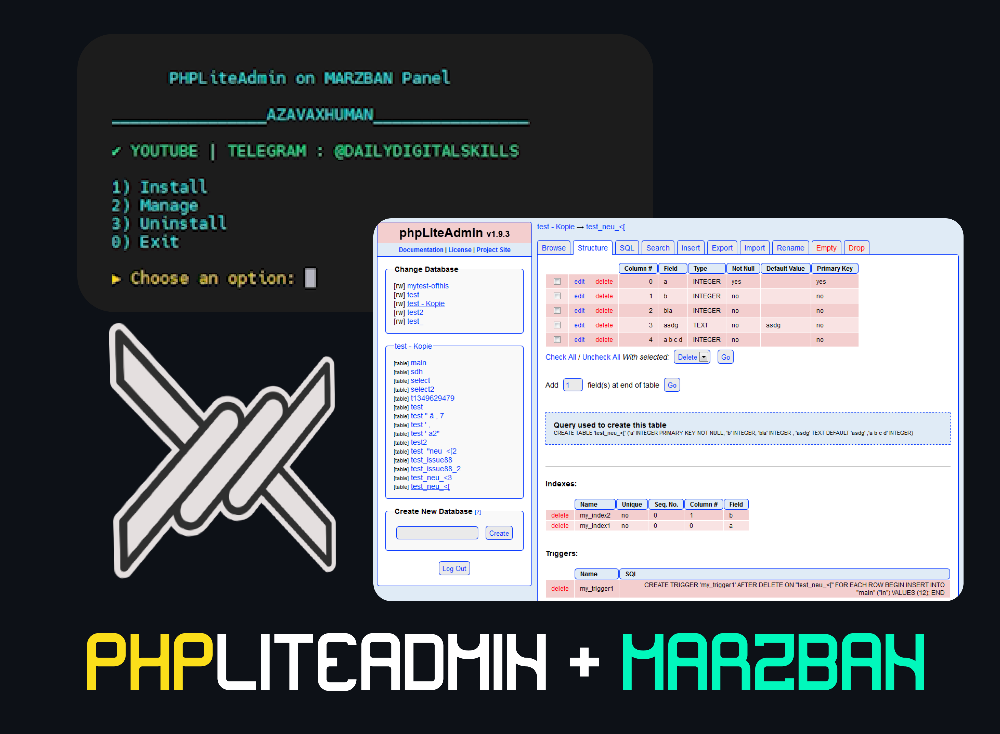

# PHPLiteAdmin + Marzban

<p align="center"></p>

## ⚡ What is it?

This is a simple script that installs and configures [PhpLiteAdmin](https://github.com/azavaxhuman/PhpLiteAdmin) on Marzban.

## 🍀 Features

- Installs and configures PhpLiteAdmin with docker.
- use haproxy on docker to serve PhpLiteAdmin .

<br>

## 👀 How to Use?

just copy/paste and enjoy :

```bash
sudo bash -c "$(curl -sL https://raw.githubusercontent.com/azavaxhuman/PhpLiteAdmin-On-Marzban/main/install.sh)"
```

## 📺 Video Tutorial

You can find a video tutorial on how to use this repository here.

- `YOUTUBE` You Can Find [The Video ( PHPLiteAdmin + Marzban ) Here](https://youtu.be/900-y56_y3w)

</details>

## Thanks

Special thanks to [(PHPLiteAdmin)](https://www.phpliteadmin.org)
